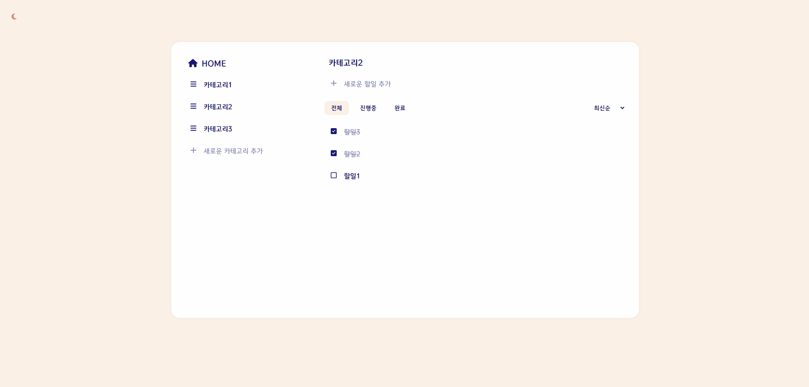

# 📖 Simple Todo List 2

**🚀 배포 링크**: [Simple Todo List 2 바로가기](https://rigood.github.io/simple-todo-list-2)

 

## 💻 프로젝트

카테고리별로 할일을 관리할 수 있는 Todo List입니다.

- 2022년 10월 22일~24일 (개인 프로젝트)
- 2023년 10월 27일 (리팩토링)

 

## 🔧 사용 기술

- React
- recoil
- recoil-persist
- styled-components

 

## 📌 주요 기능

- 카테고리 추가, 수정, 삭제
- 할일 추가, 수정, 삭제, 완료 여부 표시
- 할일 정렬 기능 (최신순, 오래된순, 가나다순, 가나다 역순)
- 할일 필터링 기능 (진행중, 완료, 전체)
- 다크모드, 라이트모드 전환

 

## 🔨 구현 방법

- React 컴포넌트 기반으로 UI 구현
- 상태관리 라이브러리인 Recoil을 이용하여 할일, 카테고리 CRUD 기능 구현
- Recoil의 selector를 이용하여 필터링, 정렬 기능 구현
- Recoil-persist를 이용하여 Local Storage에 상태값 저장
- React-router-dom으로 카테고리별 페이지 이동
- Styled-component로 다크모드 테마 설정
- 모달창 구현(수정, 삭제 메뉴 팝업)
